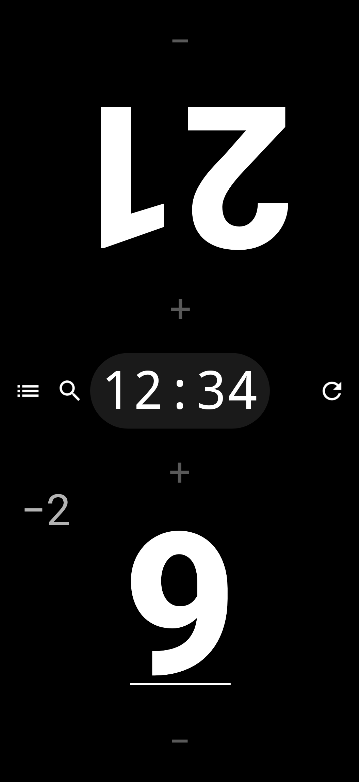
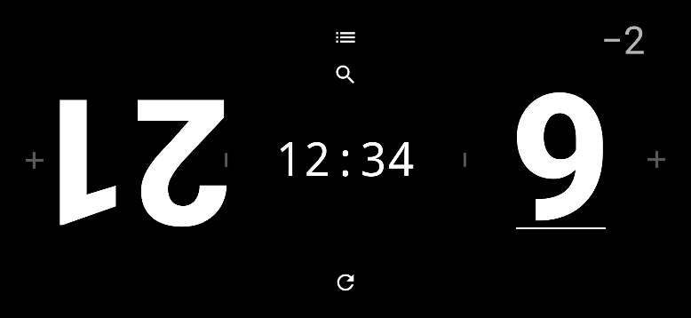

# Life Counter

A two-player TCG life counter for Android, built with Kotlin and Jetpack Compose. 

| Portrait | Landscape |
|----------|-----------|
|  |  |

## Features

- **Two life totals at once**, one per screen half, opponent's side rotated 180°.
- **Tap / hold to adjust**: single tap ±1; press-and-hold jumps by 5 and keeps repeating while held.
- **Grouped history**: rapid changes accumulate into one entry (committed 1s after the last change). The pending delta shows in a smaller font above the total while uncommitted.
- **Round timer** that counts up, auto-starts on the first life change, and pauses/resumes on tap.
- **History log** timestamped with round-timer time (mm:ss).
- **Card search-as-you-type** against the GoAgain API, with card images.
- **Reset** with a confirmation dialog offering 40 or 20 starting life.

## Build & Run

Uses the Gradle wrapper (no system Gradle needed); the build is pinned to JDK 21.

```bash
./gradlew assembleDebug     # build debug APK
./gradlew installDebug      # build + install on a connected device/emulator
./gradlew test              # JVM unit tests
```

## Architecture

Single-activity MVVM Compose app:

- `MainActivity` — hosts the Compose UI.
- `GameViewModel` — owns game state as a `StateFlow<GameState>`; all mutations (life changes, timer ticks, reset) flow through it so history logging happens in one place.
- `GameState` / `LifeChange` — immutable data classes.
- `CardSearchViewModel` — declarative Flow pipeline (`debounce` → `distinctUntilChanged` → `flatMapLatest`) for card search.

Press-and-hold repeat and the round timer are driven by coroutines in the ViewModel layer.
